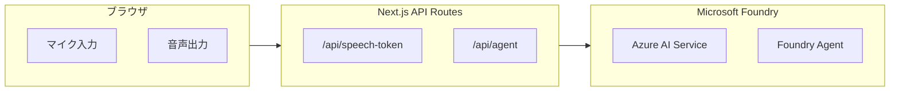

# 音声入力アプリケーション

Next.js と Azure AI Services で構築された音声対話 AI アプリケーションです。マイクボタンを使って音声を認識し、Microsoft Foundry のエージェントからの応答を音声で読み上げます。

## 機能

- 🎤 Azure AI Service によるリアルタイム音声認識
- 🤖 Microsoft Foundry エージェントによるインテリジェントな応答生成
- 🔊 音声合成による応答の読み上げ機能
- 💬 会話コンテキストの維持（連続した会話が可能）
- ✨ 録音中のアニメーション効果
- 🌙 ダークテーマ UI
- 📝 音声入力とエージェント応答のテキスト表示
- 🔐 マネージドIDによるセキュアな認証

## 前提条件

- Node.js 18 以上
- Microsoft Foundry プロジェクトとエージェント
- Azure 環境（マネージド ID 認証用）または Azure CLI でのログイン

## セットアップ

### 1. Azure リソースの準備

#### Microsoft Foundry AI サービス
Azure Portal で Microsoft Foundry リソースを作成し、以下の情報を取得してください：

- エンドポイント（例: `https://YOUR-RESOURCE-NAME.cognitiveservices.azure.com/`）
- リソース ID（例: `/subscriptions/{subscription-id}/resourceGroups/{resource-group}/providers/Microsoft.CognitiveServices/accounts/{account-name}`）
- リージョン（例: `japaneast`）

#### Microsoft Foundry エージェント
Microsoft Foundry でプロジェクトとエージェントを作成し、以下の情報を取得してください：

- プロジェクトエンドポイント（例: `https://YOUR-RESOURCE-NAME.services.ai.azure.com/api/projects/YOUR-PROJECT-NAME`）
- エージェント名

### 2. 環境変数の設定

[.env.local](.env.local) ファイルを編集して、Azure サービスの設定を記入してください：

```bash
# Microsoft Foundry - AI Service の設定
AZURE_SPEECH_ENDPOINT=https://YOUR-RESOURCE-NAME.cognitiveservices.azure.com/
AZURE_SPEECH_RESOURCE_ID=/subscriptions/{subscription-id}/resourceGroups/{resource-group}/providers/Microsoft.CognitiveServices/accounts/{account-name}
AZURE_SPEECH_REGION=japaneast

# Microsoft Foundry - Agent Service の設定
AZURE_PROJECT_ENDPOINT=https://YOUR-RESOURCE-NAME.services.ai.azure.com/api/projects/YOUR-PROJECT-NAME
AZURE_AGENT_NAME=YOUR-AGENT-NAME
```

### 3. マネージドIDの設定

アプリケーションを Azure 環境（App Service、Container Apps等）にデプロイする際は、以下を設定してください：

1. マネージドIDを有効化
2. Microsoft Foundry プロジェクトへのアクセスをマネージドIDに許可（Azure AI User ロール等）

ローカル開発時は、Azure CLIでログイン：

```bash
az login
```

### 4. 依存関係のインストール

```bash
npm install
```

### 5. 開発サーバーの起動

```bash
npm run dev
```

ブラウザで [http://localhost:3000](http://localhost:3000) を開きます。

## 使い方

1. **マイクボタンをクリック** - 音声認識を開始します
   - ボタンが赤色に変わり、アニメーション効果が表示されます
   - マイクへのアクセス許可が求められた場合は、許可してください

2. **話しかける** - 音声がリアルタイムでテキストに変換されます
   - 認識されたテキストが「音声入力」エリアに表示されます

3. **発話完了後** - 自動的にエージェントに送信されます
   - 「処理中...」が表示され、エージェントが応答を生成します
   - 応答は「エージェント応答」エリアに表示されます
   - 応答が音声で読み上げられます

4. **会話を続ける** - 再度マイクボタンをクリックして次の質問をします
   - 会話のコンテキストが維持されるため、連続した対話が可能です

## プロジェクト構成

```
manual-voice-app/
├── app/
│   ├── api/
│   │   ├── speech-token/
│   │   │   └── route.ts          # Speech トークン取得 API エンドポイント
│   │   └── agent/
│   │       └── route.ts          # Microsoft Foundry エージェントAPIエンドポイント
│   ├── globals.css                # グローバルスタイル
│   ├── layout.tsx                 # ルートレイアウト
│   └── page.tsx                   # ホームページ
├── components/
│   └── VoiceRecorder.tsx          # 音声対話コンポーネント
├── .env.local                     # 環境変数（Gitで管理しない）
├── .env.example                   # 環境変数のサンプル
├── package.json
├── tsconfig.json
├── tailwind.config.ts
└── next.config.js
```

## 技術スタック

- **フレームワーク**: Next.js 14 (App Router)
- **言語**: TypeScript
- **スタイリング**: Tailwind CSS
- **音声処理**: Azure Speech Service (Speech SDK)
- **AI エージェント**: Microsoft Foundry (@azure/ai-projects)
- **認証**: Azure マネージドID (@azure/identity)

## アーキテクチャ



### 認証の仕組み

1. バックエンド（[app/api/speech-token/route.ts](app/api/speech-token/route.ts)）が`DefaultAzureCredential`を使用して Entra ID トークンを取得
2. トークンとリソース ID を組み合わせて`aad#{resourceId}#{entraAccessToken}`形式の認証文字列を生成
3. フロントエンドがこの認証文字列を受け取り、Speech SDK で使用
4. ブラウザから直接Speech Serviceに接続して音声認識・音声合成を実行

### エージェント処理の流れ

1. 音声認識完了後、テキストを [app/api/agent/route.ts](app/api/agent/route.ts) に送信
2. `AIProjectClient`を使用して Microsoft Foundry エージェントに接続
3. 会話 ID を維持して連続した対話を実現
4. エージェントの応答をフロントエンドに返却
5. 応答テキストを音声合成で読み上げ

## トラブルシューティング

### トークン取得エラー

- 環境変数が正しく設定されているか確認
- Microsoft Foundry リソースへの IAM ロールが付与されているか確認

### エージェントAPIエラー

- `AZURE_PROJECT_ENDPOINT`と`AZURE_AGENT_NAME`が正しく設定されているか確認
- Microsoft Foundry プロジェクトへのアクセス権限があるか確認
- エージェントが正しくデプロイされているか確認

### 音声認識が動作しない

- ブラウザがマイクアクセスを許可しているか確認
- HTTPS または localhost で実行しているか確認（マイクアクセスにはセキュアなコンテキストが必要）

## ビルド

本番用にビルドするには：

```bash
npm run build
npm start
```

## デプロイ

Azure App Service や Azure Container Apps にデプロイする際は：

1. マネージド ID を有効化
2. 環境変数を設定
3. Microsoft Foundry プロジェクトへのアクセス権限を付与

## ライセンス

MIT
